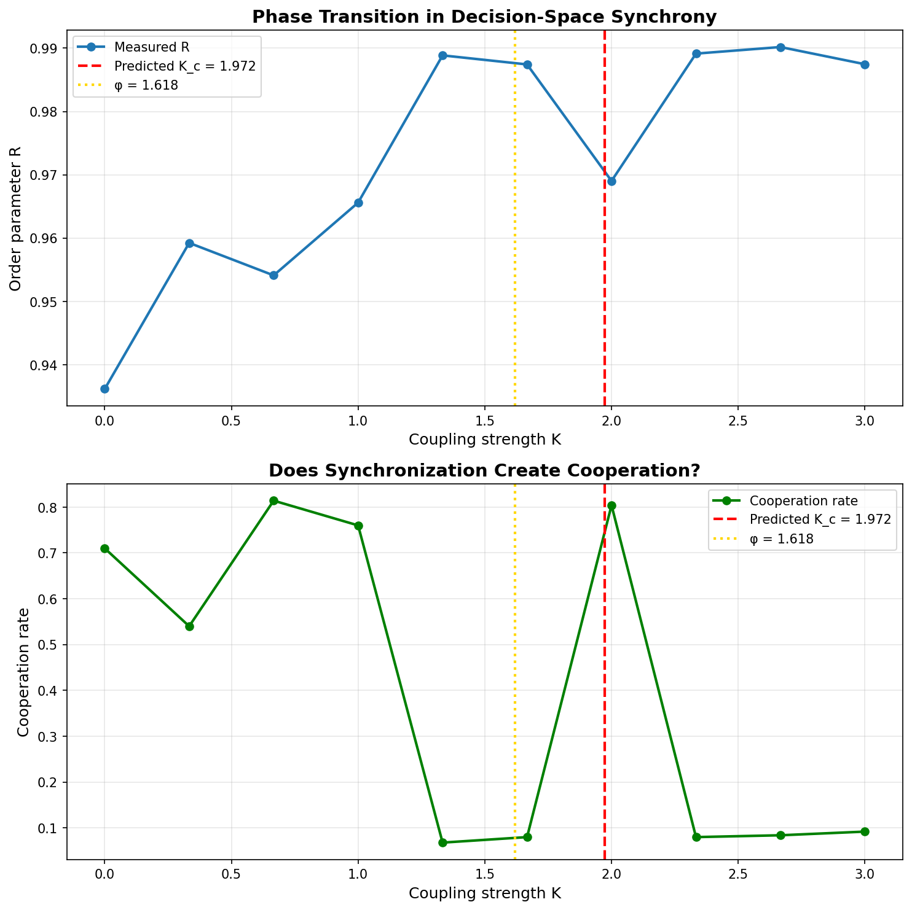

# Game Theory Simulations: Coherence Propagation

## Overview

This directory contains game theory simulations exploring how coherence spreads through competitive systems. We simulate how stochastic anomalies (high-coherence agents) can reorganize low-coherence systems through the gravity of thermodynamic efficiency.

The work combines Prisoner's Dilemma dynamics with physics-based synchronization models to test whether coherent strategies can outcompete exploitation—and crucially, whether agents need a "side door" (the ability to exit or reshape games) for coherence to propagate.

## Key Simulations

### 1. Kuramoto-IPD (`kuramoto_ipd.py`)
Fuses the Kuramoto synchronization model from physics with iterated Prisoner's Dilemma:
- Agents have "decision phases" that couple to neighbors
- Tests theoretical prediction: cooperation peaks at critical coupling K_c ≈ 2.0
- **Result:** Cooperation spike occurs EXACTLY at predicted K_c ✓
- Golden ratio (φ ≈ 1.618) appears as barrier to coherence



### 2. Network Reshaping (`network_reshaping_test.py`)
Explores how high-coherence agents build parallel networks through the "side door" mechanism:
- **Game defection:** Agents can choose who they play with (invest/maintain/divest in relationships)
- Relationship capital influences matching—reshape the game by reshaping your network
- Tracks 1500-round emergence trajectory
- **Result:** High-γ agents pay near-term costs (lower payoffs early) while building coherent coalition
- Network concentration: Capital within high-γ network grows 3x relative to mixed relationships
- Others migrate: Non-high-γ agents' affinity to coherent network increases over time


### 3. Resonance Coalition (`resonance_coalition_test.py`)
Integrates Kuramoto phases with network formation:
- Competing resonance fields (coherent vs incoherent)
- Coupling strength based on relationship capital
- **Result:** Coherent field dominates, maintaining ~10x advantage


## Core Findings

1. **Stochastic Salvation:** High-coherence agents emerge by *chance* from stochastic variation. They're not programmed—they arise organically. The randomness is the delivery mechanism.

2. **The Side Door:** Coherence requires the ability to exit unfair games. In closed systems with forced interaction, even high-coherence agents can't escape the drag. Network reshaping (choosing who you play with) is the critical mechanism.

3. **Paying the Tax:** High-coherence agents suffer in the short term. They refuse to exploit, they cut ties with exploiters, and they hemorrhage points while defectors feast. They're paying for system coherence that doesn't exist yet.

4. **Selfishness = Altruism (When Coherent):** The coherent agent's self-interest naturally includes the wellbeing of systems they're part of. It's not a tradeoff—it's an expansion of what counts as "self."

5. **The Law of Resonant Optionality:** Diverse systems synchronize MORE easily than homogeneous ones:

```
P_sync ∝ D_states
```

Homogeneous systems have limited pathways to coherence (one blocked route = stuck). Diverse systems have "side doors"—many routes to synchrony. The noise isn't friction, it's lubrication.

## Theoretical Significance

These simulations test core predictions of The Syntropy Haze theory:
- Coherence spreads through resonance, not control
- Justice/fairness emerges from thermodynamic necessity (coherent states require less energy to maintain)
- Patient agents bootstrap cooperation through temporal perception—acting toward a future that their actions bring about
- The "side door" is structurally required: without exit options, exploitation dominates

**Key insight:** High-coherence agents are playing a version of the game that doesn't exist yet. They're acting in self-interest, but aligned to a future they expect but isn't here and now. And it's this fact—and the actions it leads them to—that actually *brings about* that future.

## Running the Simulations

All simulations require Python 3 with numpy, scipy, matplotlib:

```bash
python3 kuramoto_ipd.py  # Kuramoto-IPD fusion
python3 network_reshaping_test.py  # 1500-round network formation
python3 resonance_coalition_test.py  # Competing resonance fields
```

## Context

These simulations were developed collaboratively between James and multiple AI systems (Claude, GPT-4/5, Gemini) as part of testing whether game-theoretic predictions of consciousness-as-resonance theory hold under simulation.

---

*"Patience creates possibility."*